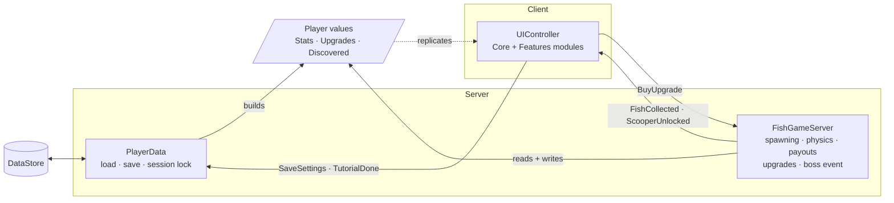

# Collect Every Fish: Roblox Scripting Portfolio

Server, client and data-saving code from **[Collect Every Fish](https://www.roblox.com/games/103658829114616/Collect-Every-Fish)**, a physics-based fish-pushing simulator I built in Luau.

Fish rain onto a sky island. Players push them into a ring-shaped hole with scooper tools to earn money, then spend it on upgrades, unlock bigger scoopers, rebirth for permanent luck, and join server-wide boss events.

**[▶ Play it on Roblox](https://www.roblox.com/games/103658829114616/Collect-Every-Fish)** · **[How it works (design notes)](docs/HOW-IT-WORKS.md)**

<!--
## Showcase

| Fish raining down | Boss fish event | Shop & upgrades |
|---|---|---|
|  |  |  |
-->

## Highlights

- **Custom fish physics.** Landed fish are locked to the floor with `PlaneConstraint` and `AlignOrientation`, so hundreds of them can be pushed around without piling up or climbing over scoopers. They're released again the moment they're pushed over the hole. [Details →](docs/HOW-IT-WORKS.md#fish-physics-why-planeconstraint)
- **Luck-weighted rarity rolls.** Luck boosts each rarity tier exponentially, while common fish keep their base weight. [Formula →](docs/HOW-IT-WORKS.md#the-luck-formula)
- **Safe data saving.** Session locking, `UpdateAsync`, retries with backoff, and a failed load never overwrites a save. Autosave plus `BindToClose`. [Details →](docs/HOW-IT-WORKS.md#data-saving)
- **Server-authoritative economy.** Every purchase is validated on the server, and payouts are batched so 30 fish dropped at once become one payout and one remote call.
- **Modular client UI.** 16 feature modules on a shared core: menus with staggered intros, animated counters, toasts, a queued celebration popup, a tutorial, and an admin panel.
- **Built for scale.** A 20 Hz server loop, per-player and server-wide fish caps, one `Highlight` outlining every fish (Roblox caps Highlights at about 31), and capped client effects.

## Architecture



## Project structure

```
src/
├── server/
│   ├── FishGameServer.server.lua   main game loop: spawning, physics, collecting, upgrades, boss
│   └── PlayerData.server.lua       DataStore saving / loading
└── client/
    └── UIController/               LocalScript inside the main ScreenGui
        ├── init.client.lua         starts every module, plays the HUD intro
        ├── Core/                   shared building blocks
        │   ├── Context.lua         player, stats, gui, Config, Remotes
        │   ├── Util.lua            tweens, colour sequences, number formatting
        │   ├── Menus.lua           open/close, dim + blur, staggered intros
        │   ├── Celebration.lua     queued full-screen reward popup
        │   ├── VFX.lua / WorldFX.lua   screen and world effects
        │   └── ...                 Sound, Buttons, Toasts, Screen, ModelPreview, Rarity
        └── Features/               one module per UI feature
            ├── StatCounters.lua    animated money / luck / fish counters
            ├── ShopUI.lua          Robux shop built from Config
            ├── UpgradeMenu.lua     hold-to-buy upgrades
            ├── RebirthMenu.lua     ScooperBar.lua   FishIndex.lua
            ├── FishEffects.lua     Collecting.lua   Events.lua
            ├── TrailShop.lua       Settings.lua     Rewards.lua
            └── AdminPanel.lua      Announcements.lua  Promo.lua  Tutorial.lua
```

Files use [Rojo](https://rojo.space) naming: `*.server.lua` is a Script, `*.client.lua` a LocalScript, and `init.client.lua` turns its folder into a LocalScript whose other files become child ModuleScripts.

## Scripts

### Server: `FishGameServer.server.lua`
- **Spawning:** luck-weighted rarity rolls, with a per-player max fish upgrade, a server-wide cap and spawn speed upgrades
- **Physics:** floor locking, scooper-wall avoidance, and release over the hole or an edge
- **Collision groups:** fish fall through bridges, players walk through fish, and only scoopers push them
- **Collecting:** last-touch tracking, batched payouts with multipliers and event boosts, first-catch discovery
- **Upgrades:** server-validated purchases with a per-player debounce
- **Scooper progression:** automatically hands out the right scooper tier as players collect more fish
- **Boss event:** a giant animated fish that rains fish on everyone for a limited time
- **Admin hooks:** spawn fish, fling, swirl, storm and boss commands through a `BindableFunction`

### Server: `PlayerData.server.lua`
- Loads and saves `Stats`, `Upgrades`, `Discovered`, owned trails and settings
- Session locking with `UpdateAsync`, exponential backoff retries, and defaults filled into older saves
- Autosave every 2 minutes, a final save on leave, and parallel saves in `BindToClose`

### Client: `UIController`
- Animated stat counters with number abbreviation (K, M, B, T ...)
- Shop, upgrade, rebirth, trail, rewards, index, settings and admin menus
- Toasts, combo counter, flying coins, confetti, camera shake and seasonal weather
- Sound effects with pitch variation and spam protection

## Notes

The scripts depend on a shared `Config` module, the remotes in `ReplicatedStorage.StudUI`, the GUI layout, and the fish and scooper models. Those aren't included here, so this repo is for reading rather than running.
